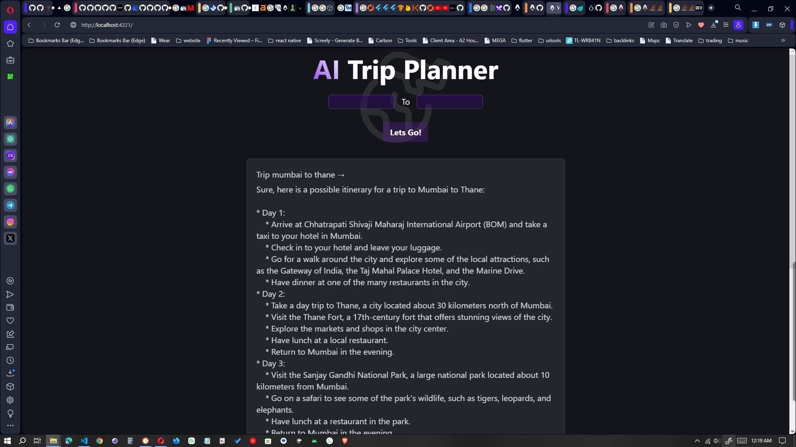

# AI Trip Planner using Palm Api

## Introduction
This is a project for the course of Artificial Intelligence. The goal of this project is to create a trip planner using the Plam Api. The user will be able to choose the city he wants to visit and the number of days he wants to stay. The program will then create a trip plan for the user, including the places he should visit each day and the hotels he should stay in each night. The program will also provide the user with the total cost of the trip.

<!-- add image trip.jpg -->

